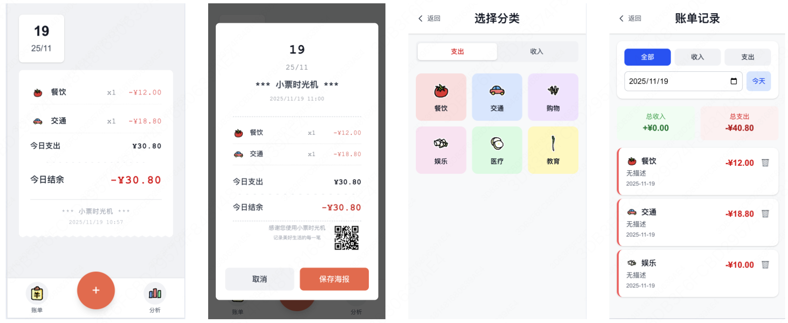

# 🦊 Fox Accounting | 狐狸记账

一款简洁优雅的个人记账应用，帮助您轻松管理日常收支，养成良好的理财习惯。

## ✨ 功能特性

### 📊 收支管理
- **快速记账** - 支持收入和支出记录，操作简单直观
- **分类管理** - 预设多种生活消费分类（餐饮、交通、购物、娱乐等）
- **实时统计** - 自动计算余额，显示今日收支汇总

### 📈 数据分析
- **图表可视化** - 使用 Chart.js 展示收支趋势和分类占比
- **历史记录** - 完整的交易记录查看和管理
- **数据筛选** - 按日期、分类等维度筛选数据

### 🎨 用户体验
- **响应式设计** - 完美适配桌面端和移动端
- **PWA 支持** - 可安装到桌面，提供原生应用体验
- **音效反馈** - 记账时的声音提示（可选）
- **收据海报** - 生成精美的收据图片便于分享

## 🛠️ 技术栈

- **前端框架**: Next.js 16.0.1 + React 19.2.0
- **UI 样式**: Tailwind CSS 4.0
- **图表库**: Chart.js + react-chartjs-2
- **类型支持**: TypeScript 5
- **其他工具**: 
  - html2canvas (截图功能)
  - qrcode.react (二维码生成)
  - react-datepicker (日期选择)

## 🚀 快速开始

### 环境要求
- Node.js 18.0.0 或更高版本
- npm、yarn、pnpm 或 bun

### 安装依赖
```bash
npm install
# 或
yarn install
# 或
pnpm install
```

### 启动开发服务器
```bash
npm run dev
# 或
yarn dev
# 或
pnpm dev
```

打开 [http://localhost:3000](http://localhost:3000) 即可在浏览器中查看应用。

### 构建生产版本
```bash
npm run build
npm run start
```

## ?? 功能截图

应用包含以下主要页面：
- **首页** (`/`) - 交易记录和快速操作
- **添加记录** (`/add`) - 新增收支记录
- **记录详情** (`/add/details`) - 详细信息录入
- **数据分析** (`/analysis`) - 图表和统计分析
- **历史记录** (`/records`) - 完整交易历史

## 🎯 项目结构

```
fox-accounting/
├── public/                 # 静态资源
│   ├── images/icons/      # 分类图标
│   ├── sounds/           # 音效文件
│   └── manifest.json     # PWA 配置
├── src/
│   ├── app/              # Next.js App Router 页面
│   ├── components/       # React 组件
│   └── constants/        # 常量和配置
├── package.json          # 项目依赖
└── README.md            # 项目说明
```

## 🔧 配置说明

### 分类设置
在 `src/constants/categories.tsx` 中可以自定义收支分类，包括：
- 图标（支持图片路径或 Emoji）
- 颜色主题
- 分类类型（收入/支出）

### PWA 配置
应用支持 PWA 功能，配置文件位于 `public/manifest.json`，包含：
- 应用名称和图标
- 主题颜色
- 启动配置

## 🚀 部署

### Vercel 部署（推荐）
1. 将代码推送到 GitHub
2. 在 [Vercel](https://vercel.com) 中导入项目
3. 自动构建和部署

### 其他平台
支持部署到任何支持 Next.js 的平台：
- Netlify
- Railway
- AWS Amplify
- 自托管服务器

## 📄 开源许可

本项目采用 MIT 许可证，详情请查看 LICENSE 文件。


# 作品介绍
你可以直接在手机或者电脑上像开一个应用一样打开一个APP，这个APP就是个记账本，你可以在里面记录你的收支情况。还可以生成海报进行分享。
这里的图标均由我的另一个项目绘制，可以访问：https://github.com/zhypower1997/comate-canvas


该项目100%代码完全由文心快码生成。


